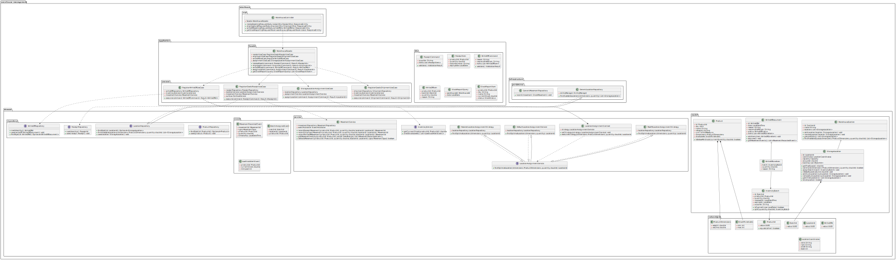

```
@startuml

package "warehouse-management" {
  package "application" {
    package "usecase" {
      class RegisterGoodsReceiptUseCase {
        - receiptRepository: ReceiptRepository
        - locationService: LocationAssignmentService
        - movementService: MovementService
        - outbox: OutboxService
        + execute(command: ReceiptCommand): Result<ReceiptId>
      }

      class RegisterGoodsShipmentUseCase {
        - shipmentRepository: ShipmentRepository
        - inventoryService: InventoryService
        - movementService: MovementService
        + execute(command: ShipmentCommand): Result<ShipmentId>
      }

      class StorageLocationAssignmentUseCase {
        - locationRepository: LocationRepository
        - assignmentService: LocationAssignmentService
        + assignLocation(command: AssignmentCommand): Result<LocationId>
      }
    }

    package "dto" {
      class ReceiptCommand {
        - supplier: String
        - items: List<ReceiptItem>
        + validate(): ValidationResult
      }

      class ReceiptItem {
        - productId: ProductId
        - quantity: double
        - batchNumber: String
        - expiryDate: LocalDate
      }

      class StockReportQuery {
        - warehouseId: WarehouseId
        - date: LocalDate
      }

      class StockReportItem {
        - productId: ProductId
        - sku: String
        - name: String
        - currentStock: double
        - status: StockStatus
      }
    }

    package "facade" {
      class WarehouseFacade {
        - receiptUseCase: RegisterGoodsReceiptUseCase
        - shipmentUseCase: RegisterGoodsShipmentUseCase
        - assignmentUseCase: StorageLocationAssignmentUseCase
        + receiveGoods(command: ReceiptCommand): Result<ReceiptId>
        + shipGoods(command: ShipmentCommand): Result<ShipmentId>
        + assignLocation(command: AssignmentCommand): Result<LocationId>
        + getStockReport(query: StockReportQuery): List<StockReportItem>
      }
    }
  }

  package "domain" {
    package "model" {
      class Product {
        - id: ProductId
        - sku: SKU
        - name: String
        - category: String
        - unit: UnitOfMeasure
        - dimensions: ProductDimensions
        - stockLevels: StockThresholds
        + isBelowMinStock(currentQuantity: double): boolean
      }

      ' Компоновщик: StorageLocation и WarehouseSection
      class StorageLocation {
        - id: LocationId
        - coordinates: LocationCoordinates
        - capacity: Capacity
        - occupied: double
        - batches: List<BatchId>
        + getFreeSpace(): double
        + canStore(dimensions: ProductDimensions, quantity: double): boolean
        + assignBatch(batch: InventoryBatch): void
        + releaseSpace(volume: double): void
        + addSubLocation(subLocation: StorageLocation): void
        + removeSubLocation(subLocation: StorageLocation): void
        + getChildLocations(): List<StorageLocation>
        + isComposite(): boolean
      }

      class InventoryBatch {
        - id: BatchId
        - productId: ProductId
        - quantity: double
        - receivedAt: LocalDateTime
        - expiresAt: LocalDate
        - supplier: String
        + isExpired(now: LocalDate): boolean
        + split(quantity: double): InventoryBatch
      }

      ' Компоновщик: WarehouseSection как композитный элемент
      class WarehouseSection {
        - id: SectionId
        - name: String
        - locations: List<StorageLocation>
        + addLocation(location: StorageLocation): void
        + removeLocation(location: StorageLocation): void
        + getLocations(): List<StorageLocation>
        + findAvailableSpace(dimensions: ProductDimensions, quantity: double): List<StorageLocation>
      }
    }

    package "valueobject" {
      class ProductId {
        - value: UUID
        + equals(other): boolean
      }

      class BatchId {
        - value: UUID
      }

      class LocationId {
        - value: UUID
      }

      class LocationCoordinates {
        - zone: String
        - rack: String
        - shelf: String
        - level: int
      }

      class ProductDimensions {
        - weight: double
        - volume: double
      }

      class StockThresholds {
        - min: int
        - max: int
      }
    }

    package "service" {
      ' Стратегия: LocationAssignmentService и его реализации
      interface LocationAssignmentService {
        + findOptimalLocation(dimensions: ProductDimensions, quantity: double): LocationId
      }

      class DefaultLocationAssignmentService {
        - locationRepository: LocationRepository
        + findOptimalLocation(dimensions, quantity): LocationId
      }

      ' Стратегия: реализация на основе ближайшего места
      class NearestLocationAssignmentStrategy {
        - locationRepository: LocationRepository
        + findOptimalLocation(dimensions, quantity): LocationId
      }

      ' Стратегия: реализация на основе максимального заполнения
      class MaxFillLocationAssignmentStrategy {
        - locationRepository: LocationRepository
        + findOptimalLocation(dimensions, quantity): LocationId
      }

      ' Контекст для стратегии
      class LocationAssignmentContext {
        - strategy: LocationAssignmentService
        + setStrategy(strategy: LocationAssignmentService): void
        + executeStrategy(dimensions: ProductDimensions, quantity: double): LocationId
      }

    }

    package "event" {
      class MovementRecordedEvent {
        - movementId: MovementId
        - type: MovementType
        - productId: ProductId
        - quantity: double
        - timestamp: LocalDateTime
      }

      class BatchAssignedEvent {
        - batchId: BatchId
        - locationId: LocationId
        - productId: ProductId
      }
    }

    package "repository" {
      interface ProductRepository {
        + findById(id: ProductId): Optional<Product>
        + save(product: Product): void
      }

      interface LocationRepository {
        + findById(id: LocationId): Optional<StorageLocation>
        + findAvailableLocations(dimensions: ProductDimensions, quantity: double): List<StorageLocation>
        + save(location: StorageLocation): void
      }

      interface ReceiptRepository {
        + nextIdentity(): ReceiptId
        + save(receipt: Receipt): void
      }
    }
  }

  package "infrastructure" {
    package "persistence" {
      class GenericLocationRepository {
        - entityManager: EntityManager
        + findAvailableLocations(dimensions, quantity): List<StorageLocation>
      }

      class GenericMovementRepository {
        + record(movement: StockMovement): void
      }
    }

  }

  package "interfaces" {
    package "rest" {
      class WarehouseController {
        - facade: WarehouseFacade
        + receiveGoods(@RequestBody receiptDto: ReceiptDto): ResponseEntity
        + getStockReport(@RequestParam warehouse, @RequestParam date): ResponseEntity
      }
    }
  }
}

' Зависимости (Dependency)
WarehouseFacade ..> RegisterGoodsReceiptUseCase
WarehouseFacade ..> RegisterGoodsShipmentUseCase
WarehouseFacade ..> StorageLocationAssignmentUseCase

RegisterGoodsReceiptUseCase ..> LocationAssignmentContext
RegisterGoodsReceiptUseCase ..> ReceiptRepository

StorageLocationAssignmentUseCase ..> LocationAssignmentContext
LocationAssignmentContext ..> LocationAssignmentService
DefaultLocationAssignmentService ..|> LocationAssignmentService
NearestLocationAssignmentStrategy ..|> LocationAssignmentService
MaxFillLocationAssignmentStrategy ..|> LocationAssignmentService

GenericLocationRepository ..|> LocationRepository

WarehouseController ..> WarehouseFacade

' Агрегация (Aggregation)
WarehouseSection o-- StorageLocation
InventoryBatch --> ProductId
InventoryBatch --> LocationId

' Композиция (Composition)
StorageLocation *-- BatchId
Product *-- StockThresholds
Product *-- ProductDimensions

' Наследование/Реализация (Generalization)
DefaultLocationAssignmentService <|-- LocationAssignmentService
NearestLocationAssignmentStrategy <|-- LocationAssignmentService
MaxFillLocationAssignmentStrategy <|-- LocationAssignmentService
GenericLocationRepository <|-- LocationRepository

@enduml
```
