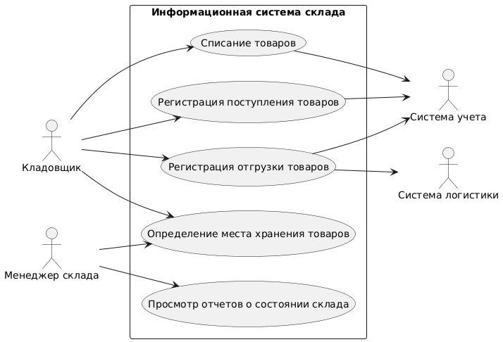

```
@startuml activity
skinparam packageStyle rect
left to right direction

:Кладовщик:
:Менеджер склада:
:Администратор системы:
:Система учета:
:Система логистики:

package "Информационная система склада" {
  (Регистрация поступления товаров)
  (Регистрация отгрузки товаров)
  (Списание товаров)
  (Определение места хранения товаров)
  (Просмотр отчетов о состоянии склада)
  (Управление пользователями)
  (Обнаружение недостатка товара при отгрузке)
}

:Кладовщик: --> (Регистрация поступления товаров) : выполняет
:Кладовщик: --> (Регистрация отгрузки товаров) : выполняет
:Кладовщик: --> (Списание товаров) : выполняет
:Кладовщик: --> (Определение места хранения товаров) : выполняет

:Менеджер склада: --> (Определение места хранения товаров) : управляет
:Менеджер склада: --> (Просмотр отчетов о состоянии склада) : просматривает

:Администратор системы: --> (Управление пользователями) : настраивает

(Регистрация поступления товаров) --> :Система учета: : регистрирует
(Регистрация отгрузки товаров) --> :Система учета: : регистрирует
(Регистрация отгрузки товаров) --> :Система логистики: : уведомляет
(Списание товаров) --> :Система учета: : регистрирует

(Регистрация поступления товаров) .> (Определение места хранения товаров) : определяет место
(Регистрация отгрузки товаров) .> (Обнаружение недостатка товара при отгрузке) : выявляет недостаток

@enduml
```
