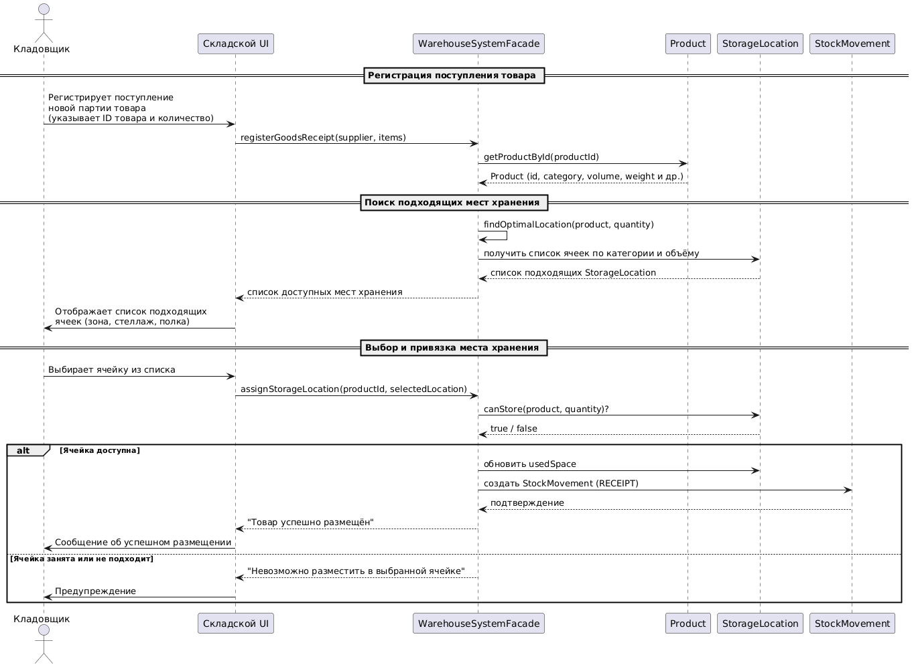

```
@startuml
actor Кладовщик
participant "Складской UI" as UI
participant "WarehouseService" as WS
participant "StorageLocationCatalog" as Catalog
participant "ProductRegistry" as ProductReg
participant "PlacementLog" as Log

== Регистрация поступления товара ==

Кладовщик -> UI: Регистрирует поступление\nновой партии товара\n(указывает ID товара и количество)

UI -> ProductReg: getProductById(productId)
ProductReg --> UI: Product (название, вес, объём, категория)

== Поиск подходящих ячеек ==

UI -> WS: findSuitableLocations(Product)
WS -> Catalog: getAvailableLocationsByCategory(Product.category)
Catalog --> WS: Список ячеек с подходящими характеристиками
WS -> Catalog: filterByCapacity(ячейки, Product.volume)
Catalog --> WS: Отфильтрованный список ячеек
WS --> UI: Список подходящих ячеек

UI -> Кладовщик: Отображает список\nсвободных ячеек

== Выбор места хранения ==

Кладовщик -> UI: Выбирает ячейку из списка

UI -> WS: assignProductToLocation(Product, selectedLocationId)

WS -> Catalog: lockLocation(selectedLocationId)
Catalog --> WS: Ячейка успешно заблокирована
WS -> Catalog: updateLocationOccupancy(selectedLocationId, Product.volume)
Catalog --> WS: Статус обновлён

== Фиксация размещения ==

WS -> Log: logPlacement(productId, selectedLocationId, timestamp)
Log --> WS: Запись сохранена

WS --> UI: Подтверждение размещения

UI -> Кладовщик: Показывает сообщение:\n"Товар успешно размещён в ячейке X"
@enduml
```