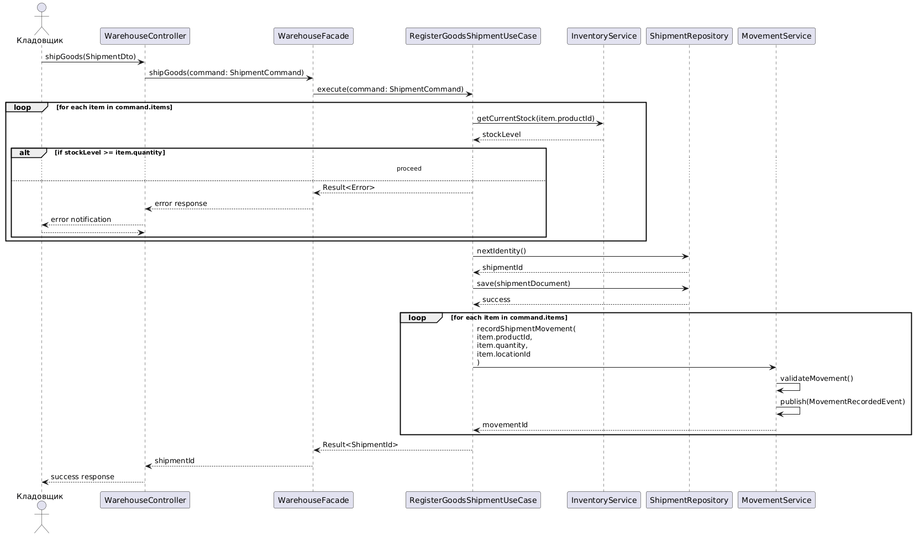

```
@startuml
actor Кладовщик

participant UI
participant WarehouseFacade
participant User
participant "IShipmentRepository" as IRepo
participant "ShipmentRepository" as Repo
participant "StockService" as StockSvc
participant "LocationService" as LocSvc
participant "OrderService" as OrderSvc
participant "Integration1C" as Int1C
participant "LogisticsIntegration" as LogInt
participant Database

Кладовщик -> UI: Выбирает "Отгрузка товаров"
activate UI

UI -> WarehouseFacade: CreateShipmentDocument(userId: uint32)
activate WarehouseFacade

WarehouseFacade -> User: GetUserById(userId)
activate User
User --> WarehouseFacade: user
deactivate User

WarehouseFacade -> IRepo: CreateDraft(customer, orderNumber)
activate IRepo
IRepo -> Repo: Create(document)
activate Repo
Repo -> Database: INSERT INTO shipment_documents (...)
activate Database
Database --> Repo: documentId
deactivate Database
Repo --> IRepo: ShipmentDocument
deactivate Repo
IRepo --> WarehouseFacade: document
deactivate IRepo

Кладовщик -> UI: Выбирает заказ для отгрузки
UI -> WarehouseFacade: SelectOrder(documentId, orderId)
activate WarehouseFacade

WarehouseFacade -> OrderSvc: GetOrderDetails(orderId)
activate OrderSvc
OrderSvc -> Database: SELECT * FROM orders WHERE id = orderId
activate Database
Database --> OrderSvc: orderDetails
deactivate Database
OrderSvc --> WarehouseFacade: orderItems
deactivate OrderSvc

loop по каждой позиции заказа
WarehouseFacade -> StockSvc: CheckAvailability(productId, qty)
activate StockSvc
StockSvc -> Database: SELECT SUM(quantity) FROM stock WHERE productId = ...
activate Database
Database --> StockSvc: availableQty
deactivate Database

alt availableQty >= qty
StockSvc --> WarehouseFacade: Available
else availableQty < qty
StockSvc --> WarehouseFacade: PartialAvailability(availableQty)
WarehouseFacade -> UI: ShowPartialAvailabilityWarning
Кладовщик -> UI: Подтверждает частичную отгрузку
UI -> WarehouseFacade: ConfirmPartialShipment
end
deactivate StockSvc

WarehouseFacade -> LocSvc: FindLocationsForPicking(productId, qty)
activate LocSvc
LocSvc -> Database: SELECT locationId, quantity FROM stock WHERE productId = ... ORDER BY expiryDate ASC
activate Database
Database --> LocSvc: locations
deactivate Database
LocSvc --> WarehouseFacade: pickingLocations
deactivate LocSvc

Кладовщик -> UI: Сканирует товары с указанных мест
UI -> WarehouseFacade: PickItem(documentId, productId, locationId, pickedQty)
activate WarehouseFacade

WarehouseFacade -> StockSvc: ReserveStock(productId, locationId, pickedQty)
activate StockSvc
StockSvc -> Database: UPDATE stock SET reserved += pickedQty WHERE locationId = ...
Database --> StockSvc: OK
deactivate StockSvc

WarehouseFacade --> UI: ItemReserved
deactivate WarehouseFacade
end

Кладовщик -> UI: Нажимает "Провести отгрузку"
UI -> WarehouseFacade: PostShipmentDocument(documentId)
activate WarehouseFacade

WarehouseFacade -> StockSvc: ProcessShipment(documentId)
activate StockSvc

loop для каждого зарезервированного товара
StockSvc -> Database: UPDATE stock SET quantityOnHand -= pickedQty, reserved -= pickedQty WHERE locationId = ...
activate Database
Database --> StockSvc: OK
deactivate Database

StockSvc -> LocSvc: UpdateLocationStatus(locationId)
activate LocSvc
LocSvc -> Database: UPDATE locations SET occupiedSpace -= volume WHERE id = locationId
Database --> LocSvc: OK
deactivate LocSvc
end

StockSvc --> WarehouseFacade: ShipmentProcessed
deactivate StockSvc

WarehouseFacade -> Repo: SetStatus(documentId, SHIPPED)
activate Repo
Repo -> Database: UPDATE shipment_documents SET status = 'SHIPPED'
deactivate Repo

WarehouseFacade -> Int1C: SendTo1C(documentId)
activate Int1C
Int1C --> WarehouseFacade: OK
deactivate Int1C

WarehouseFacade -> LogInt: CreateDeliveryRequest(documentId)
activate LogInt
LogInt --> WarehouseFacade: deliveryId
deactivate LogInt

WarehouseFacade --> UI: ShipmentPosted
deactivate WarehouseFacade
UI --> Кладовщик: Отгрузка успешно зарегистрирована
deactivate UI

note right of UI
Документ отгрузки включает:

Товарную накладную
Упаковочный лист
Маршрутный лист для сборки
end note
note over LogInt, Int1C
Интеграция с внешними системами
происходит асинхронно. При ошибке
данные сохраняются в очереди на
повторную отправку.
end note
@enduml
```