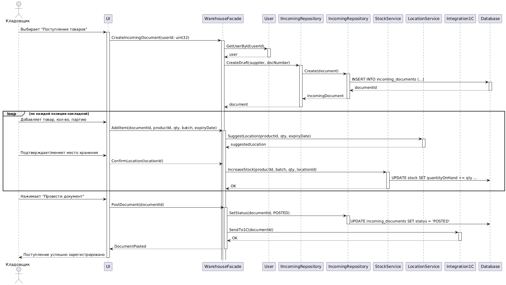

```
@startuml
actor Кладовщик

participant UI
participant WarehouseFacade
participant User
participant "IIncomingRepository" as IRepo
participant "IncomingRepository" as Repo
participant "StockService" as StockSvc
participant "LocationService" as LocSvc
participant "Integration1C" as Int1C
participant Database

Кладовщик -> UI: Выбирает "Поступление товаров"
activate UI

UI -> WarehouseFacade: CreateIncomingDocument(userId: uint32)
activate WarehouseFacade

WarehouseFacade -> User: GetUserById(userId)
activate User
User --> WarehouseFacade: user
deactivate User

WarehouseFacade -> IRepo: CreateDraft(supplier, docNumber)
activate IRepo
IRepo -> Repo: Create(document)
activate Repo
Repo -> Database: INSERT INTO incoming_documents (...)
activate Database
Database --> Repo: documentId
deactivate Database
Repo --> IRepo: IncomingDocument
deactivate Repo
IRepo --> WarehouseFacade: document
deactivate IRepo

loop по каждой позиции накладной
    Кладовщик -> UI: Добавляет товар, кол-во, партию
    UI -> WarehouseFacade: AddItem(documentId, productId, qty, batch, expiryDate)
    activate WarehouseFacade

    WarehouseFacade -> LocSvc: SuggestLocation(productId, qty, expiryDate)
    activate LocSvc
    LocSvc --> WarehouseFacade: suggestedLocation
    deactivate LocSvc

    Кладовщик -> UI: Подтверждает/меняет место хранения
    UI --> WarehouseFacade: ConfirmLocation(locationId)

    WarehouseFacade -> StockSvc: IncreaseStock(productId, batch, qty, locationId)
    activate StockSvc
    StockSvc -> Database: UPDATE stock SET quantityOnHand += qty ...
    StockSvc --> WarehouseFacade: OK
    deactivate StockSvc
end

Кладовщик -> UI: Нажимает "Провести документ"
UI -> WarehouseFacade: PostDocument(documentId)
activate WarehouseFacade

WarehouseFacade -> Repo: SetStatus(documentId, POSTED)
activate Repo
Repo -> Database: UPDATE incoming_documents SET status = 'POSTED'
deactivate Repo

WarehouseFacade -> Int1C: SendTo1C(documentId)
activate Int1C
Int1C --> WarehouseFacade: OK
deactivate Int1C

WarehouseFacade --> UI: DocumentPosted
deactivate WarehouseFacade
UI --> Кладовщик: Поступление успешно зарегистрировано

deactivate UI
@enduml
```
