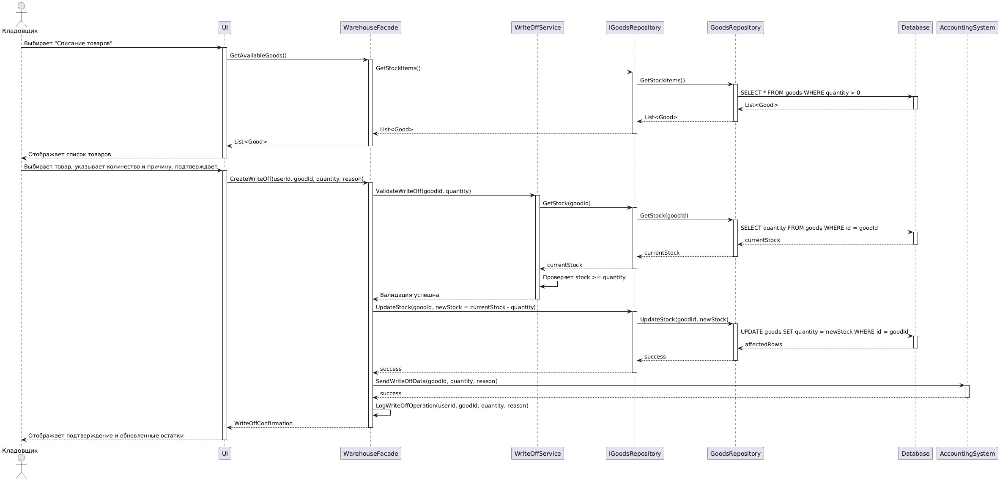

```
@startuml
actor "Кладовщик" as actor
participant "WarehouseController" as controller
participant "WarehouseFacade" as facade
participant "RegisterWriteOffUseCase" as usecase
participant "WriteOffCommand" as command
participant "InventoryService" as inventory
participant "MovementService" as movement
participant "WriteOffRepository" as repo
participant "WriteOffDocument" as document

actor -> controller : writeOffGoods(writeOffDto)
activate controller
controller -> facade : writeOffGoods(command)
activate facade
facade -> usecase : execute(command)
activate usecase
usecase -> command : validate()
activate command
command --> usecase : ValidationResult
deactivate command

loop Для каждого элемента в command.items
usecase -> inventory : getCurrentStock(item.productId)
activate inventory
inventory --> usecase : currentStock
deactivate inventory
end

usecase -> document : new WriteOffDocument(reason, responsiblePerson)
activate document
loop Для каждого элемента в command.items
usecase -> document : addItem(WriteOffLineItem)
activate document
document -> document : create InventoryBatch(batchId)
document --> usecase : WriteOffLineItem
deactivate document
usecase -> movement : recordWriteOffMovement(item.productId, item.quantity, locationId)
activate movement
movement --> usecase : MovementId
deactivate movement
end

usecase -> repo : save(document)
activate repo
repo --> usecase : WriteOffId
deactivate repo

usecase --> facade : Result
deactivate usecase
facade --> controller : Result
deactivate facade
controller --> actor : ResponseEntity
deactivate controller
@enduml
```